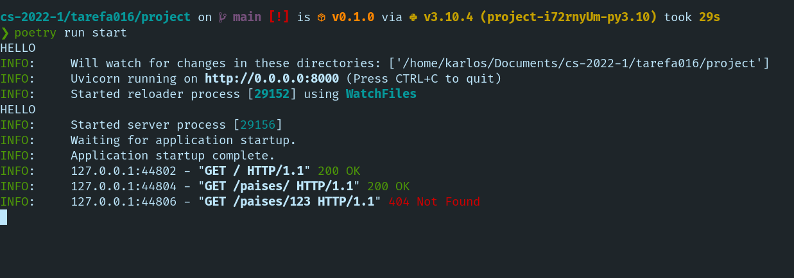

O projeto desenvolvido como exemplo é um serviço Web RESTful bem simples que utiliza a linguagem
Python 3.10, o SGBD PostgreSQL, os frameworks FastAPI, uvicorn e SQLAlchemy e o gerenciador de
dependências do Python chamado Poetry.

O framework de desenvolvimento de Web services FastAPI é focado no desenvolvimento de serviços Web
RESTful (serviços Web com interface definida por uma API REST).


## Configuração em tempo de execução

Uma das principais técnicas de configuração de software em tempo de execução é o uso dos padrões
inversão de controle (**inversion of control**) e injeção de dependências (**dependency injection**).

A inversão de controle transfere o controle e objetos ou outros componentes de software para um
container ou um framework. Com a injeção de dependência, o controle que está sendo invertido é
configurado como uma dependência.

O framework FastAPI utiliza extensivamente o conceito de injeção de dependências e inversão de
controle, tendo várias seções de sua documentação destinadas a tal conceito.
(https://fastapi.tiangolo.com/tutorial/dependencies/). Tal framework possui um sistema elegante e
simples de injeção de dependências que, por sua vez, é utilizado principalmente para as seguintes
tarefas:

- Criação de conexões com SGBDs.
- Configurações de autenticações e permissões.
- Paginação de resultados de consultas.
- Integração com outros serviços, como serviços de e-mail, computação em núvel e outros.

No FastAPI, a injeção de dependêcias é utilizada por meio da função `Depends()`, na qual é passada
um objeto *callable*, geralmente uma função ou classe.

Por exemplo, no exemplo abaixo, a função que retorna um sessão de conexão com o SGBD é uma
dependência que é injetada pelo FastAPI:

```python
import uvicorn
from fastapi import Depends, FastAPI, HTTPException, status
from sqlalchemy.orm import Session

from . import crud, models, schemas
from .database import SessionLocal, engine

models.Base.metadata.create_all(engine)

app = FastAPI()


# Dependência a ser injetada.
def get_db():
    db = SessionLocal()
    try:
        yield db
    finally:
        db.close()


@app.get('/')
def read_root():
    return {'hello': 'world'}


# A função `create_pais()` tem como dependência uma sessão de conexão
# com o SGBD retornada pela # função `get_db()`.
@app.post('/paises/', response_model=schemas.Pais)
def create_pais(pais: schemas.PaisCreate, db: Session = Depends(get_db)):
    db_pais = crud.get_pais_by_nome(db, nome=pais.nome)
    if db_pais:
        raise HTTPException(
            status.HTTP_400_BAD_REQUEST,
            detail='Nome de país já cadastrado'
        )

    return crud.create_pais(db, pais=pais)
```

## Closure

Closure é uma técnica de programação proveniente do paradigma função que permite o acesso de
valores em função fora de seu escopo, geralmente através do uso de funções aninhadas.
No Python, temos uma closure quando uma função aninhada referencia um valor definido na função externa
e essa retorna a função interna.

Por exemplo:

```python
>>> def make_multiplier_of(n: float):
...     def multiplier(x: float):
...         return n * x
...     return multiplier
...
>>> multiplier_of_3 = make_multiplier_of(3)
>>> multiplier_of_5 = make_multiplier_of(5)
>>> multiplier_by_3 = make_multiplier_of(3)
>>> multiplier_by_5 = make_multiplier_of(5)
>>> multiplier_by_3(5)
15
>>> multiplier_by_5(5)
25
```

Uma das principais aplicações do conceito de closure do Python é para a realização de outro
conceito chamado *decorator*. Um decorator é um padrão de projeto que permite a extensão do
comportamento de uma função através de outra função, chamada de decorator. No Python, um decorator
retorna uma closure que é utilizada para alterar o comportamento da função abaixo do decorator.

No FastAPI, as funções que são invocadas quando uma determinada requisição é recebida, chamadas de
**path operations** têm seu comportamento modificadas com o uso de decorators, através da notação
com o caractere @.

Por exemplo, no trecho abaixo o decorator `@app.get()` é define uma `path operation` para o método
POST, com path de URL "/paises/", com o parâmetro de rota/path `pais_id` e com o modelo de resposta
definido no modelo Pydantic schemas.Pais:

```python
@app.get('/paises/{pais_id}', response_model=schemas.Pais)
def read_pais(pais_id: int, db: Session = Depends(get_db)):
    db_pais = crud.get_pais(db, pais_id=pais_id)

    if db_pais is None:
        raise HTTPException(status.HTTP_404_NOT_FOUND,
                            detail='País não encontrado')

    return db_pais
```

## Logging 

Como podemos ver ao executar o a apliação, o servidor web assíncrono no qual o FastAPI é implementado,
o **Uvicorn** já possui um mecanismo de logging implementado.



É possível realizar configurações básicas do mecanismo de logging do Uvicorn através da passagem
de parâmetros ao método `uvicorn.run()`:

```python
uvicorn.run('project.src.main:app', host='0.0.0.0', port=8000, reload=True, log_level='warning', log_config=...)
```


